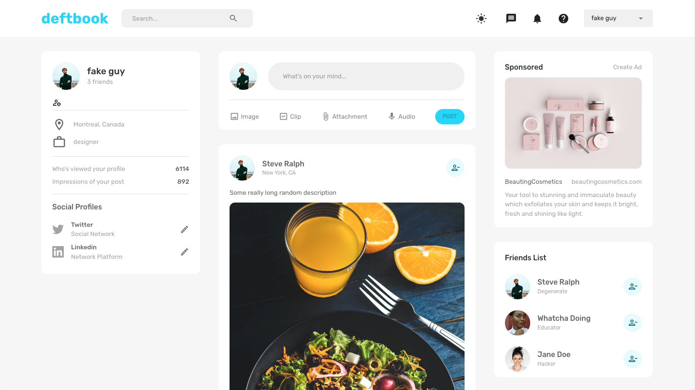
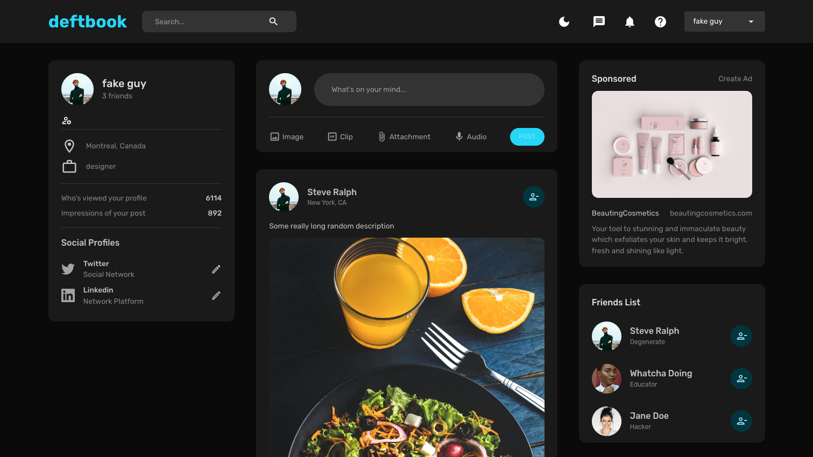

<!-- Title Description -->
# Social Media App 
MERN full stack Social Media App.
The front end is created with react and redux and styling with material ui. The UI offers both dark and light mode.
The backend is created with the MERN stack and Mongodb Atlas and Multer. Authentication is handled by JWT.

 
 
<!-- Technologies used -->

 
<h2 align="left">🛠 Languages and Tools:</h2>
 

 
 
</a>

</a>

 
 <!-- Screenshot -->

 

Light Mode Theme

  </a> 

  
  
 
Dark Mode Theme

    </a> 

 
 

 
 

   <!-- Online link -->
   <!-- 
 
<h2 align="left">👀 View online:</h2>
 
<a href="https://deftpegreacttodofirst.netlify.app/" target="_blank" rel="noreferrer">
Take me to the website, </a>
or alternately, click on the image 👉

  -->

 

